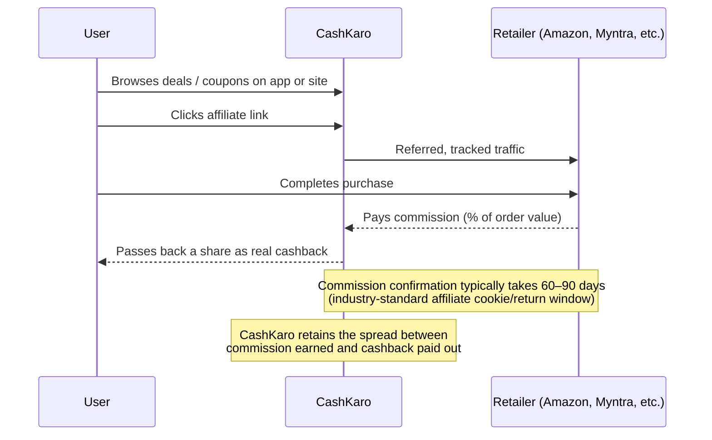
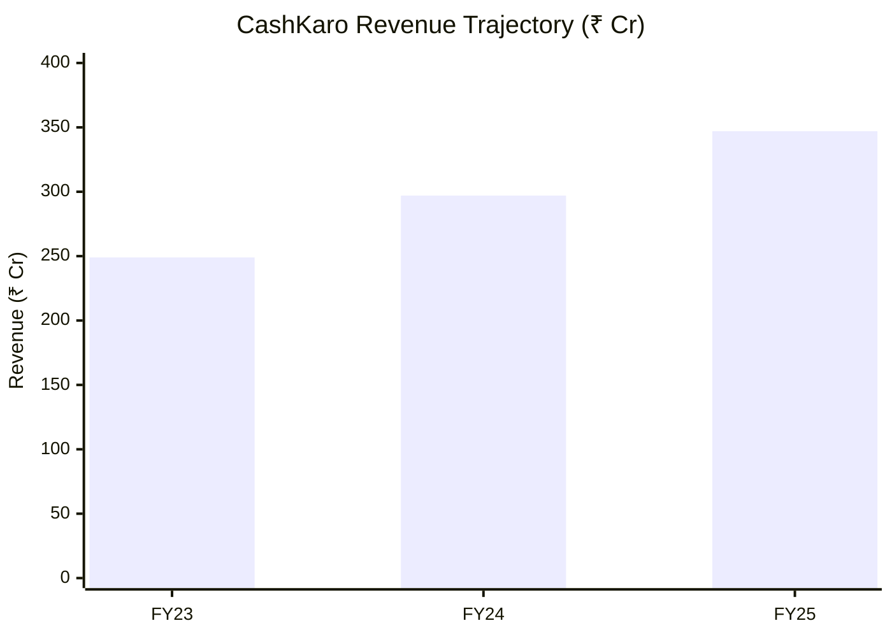

# CashKaro: Business Model & Strategic Case Study

> A deep-dive case study on CashKaro (Pouring Pounds India Pvt. Ltd.), India's largest cashback and coupon affiliate platform. Compiled from public financial disclosures, press coverage, and industry data as of FY25 reporting.

---

## Table of Contents

1. [Executive Summary](#1-executive-summary)
2. [Company Overview](#2-company-overview)
3. [Founding Story & Market Entry Strategy](#3-founding-story--market-entry-strategy)
4. [Business Model](#4-business-model)
5. [Unit Economics](#5-unit-economics)
6. [Financial Trajectory](#6-financial-trajectory)
7. [Competitive Landscape](#7-competitive-landscape)
8. [Porter's Five Forces](#8-porters-five-forces)
9. [SWOT Analysis](#9-swot-analysis)
10. [Strategic Risks & Open Questions](#10-strategic-risks--open-questions)
11. [Discussion / Interview Prep Questions](#11-discussion--interview-prep-questions)
12. [Sources](#12-sources)

---

## 1. Executive Summary

CashKaro is India's largest cashback-and-coupon affiliate marketing platform, founded in 2013 by Rohan and Swati Bhargava after they ran a similar model (Pouring Pounds) in the UK. The company sits between e-commerce retailers and price-sensitive Indian shoppers, earning affiliate commissions on referred sales and passing a share back to users as real cashback.

**Key facts (FY25):**
- Revenue: **~₹344–350 Cr**, up ~18–21% YoY
- GMV facilitated: **~₹6,000 Cr** across 1,500+ retail partners
- EBITDA: **loss of ~₹21 Cr** (widened from ~₹15 Cr loss in FY24)
- Total funding raised: **~$30–32.5M** across 5–6 rounds; last raise Nov 2022 (Series C)
- Backers include Kalaari Capital, Affle Global, Korea Investment Partners, and the late Ratan Tata

**Core tension the case explores:** CashKaro has built genuine scale and brand trust in a thin-margin, structurally commoditized business (cost of cashback alone is reportedly >50% of total expenditure), while growth has been decelerating and losses widening even as GMV scales — raising the question of whether the path to profitability lies in mix-shift (financial services), pricing discipline (lower payout rates), or a lower-CAC distribution model (its own EarnKaro sharing app).

---

## 2. Company Overview

| Attribute | Detail |
|---|---|
| Founded | 2013, Gurugram, India |
| Founders | Rohan Bhargava & Swati Bhargava (LSE graduates, ex-Goldman Sachs) |
| Legal entity | Pouring Pounds India Pvt. Ltd. (subsidiary of UK-based Pouring Pounds Ltd.) |
| Sector | Cashback & coupon affiliate marketing / e-commerce enablement |
| Flagship product | CashKaro app & website |
| Sister product | EarnKaro — deal-sharing / social commerce distribution app |
| Headcount | ~250+ employees (as of 2026 filings) |
| Key investors | Kalaari Capital, Affle Global, Korea Investment Partners, Ratan Tata (personal investment) |
| Total funding | ~$30–32.5M across 5–6 rounds (Seed 2013 → Series C Nov 2022) |
| Users | ~25M+ registered users, 20M+ app downloads |
| Retail partners | 1,500+ (Amazon, Flipkart, Myntra, Ajio, Nykaa, Swiggy, MakeMyTrip, banks/NBFCs) |

---

## 3. Founding Story & Market Entry Strategy

Rohan and Swati Bhargava met at the London School of Economics and both worked in finance, including at Goldman Sachs, before launching **Pouring Pounds**, a cashback website targeting the UK market. Having validated the model there, they identified India as a structurally better fit: a large, price-sensitive, discount-seeking consumer base entering online shopping at scale, with almost no local cashback infrastructure at the time.

This is a textbook **model-arbitrage / market-timing play**:
1. Validate a business model in a market with available data and lower execution risk (UK).
2. Identify a larger, underserved market with more favorable behavioral tailwinds (India's savings culture + rising e-commerce penetration).
3. Relocate and localize before local competitors can establish the same retailer relationships and brand trust.

The timing (2013) preceded India's major e-commerce boom (driven by Flipkart/Amazon scaling, and later Jio-driven internet penetration from 2016), giving CashKaro a multi-year head start in establishing affiliate relationships with major retailers — an advantage that compounds because affiliate network relationships and cashback-payout trust are largely non-transferable brand assets.

---

## 4. Business Model

CashKaro operates a **pure affiliate marketing / commission-arbitrage model** — it holds no inventory, does no logistics, and never touches the transacting product.

### Revenue streams

| Stream | Description | Margin characteristics |
|---|---|---|
| **E-commerce affiliate commissions** | Core historical revenue — % commission on referred sales across 1,500+ retail partners | Thin, competitive, cashback-rate-sensitive |
| **Financial services vertical** | Credit card, personal loan, mutual fund, and insurance referrals | Higher margin, reportedly ~20% of revenue by FY24; strategic growth priority |
| **EarnKaro (sharing layer)** | Users earn commission for *sharing* deal links (WhatsApp/Telegram distribution) | Lower CAC than direct app acquisition; extends reach into deal-sharing communities |

### Why the model works
- **Zero inventory / zero logistics risk** — a pure demand-generation and routing layer.
- **Aligned incentives across all three sides** — retailers pay only for performance (conversions), users get "free" money on behavior they'd do anyway, CashKaro captures the spread.
- **Positioned to retailers as a lower-cost acquisition channel** relative to rising CPMs/CPCs on Google and Meta.

### Structural constraints
- **Cost of cashback dominates the cost structure** — reportedly >50% of total expenditure, meaning gross margin is inherently thin and directly exposed to competitive cashback-rate wars.
- **60–90 day commission confirmation windows** are an industry-wide affiliate norm, creating working-capital lag and a trust gap between when a user "earns" cashback and when it's actually payable.
- **Zero pricing power over suppliers** — commission rates, cookie windows, and program terms are set unilaterally by retailers and can be changed or revoked at any time.
- **Disintermediation risk** — large retailers can and do build in-house loyalty/cashback programs, cutting out the affiliate layer entirely.

---

## 5. Unit Economics

Illustrative, order-of-magnitude economics based on disclosed aggregates (FY25: ~₹6,000 Cr GMV → ~₹344–350 Cr revenue → ~₹21 Cr EBITDA loss):

| Metric | Approx. value | Derivation |
|---|---|---|
| Effective take rate (revenue / GMV) | **~5.7–5.8%** | ₹344–350 Cr ÷ ₹6,000 Cr |
| Avg. revenue per transaction | **~₹96–97** | ₹344–350 Cr ÷ ~36M transactions |
| Avg. order value implied | **~₹1,650–1,700** | ₹6,000 Cr ÷ ~36M transactions |
| Cashback cost (illustrative, at ~50% of expenditure) | **material majority of opex** | Per reported cost structure commentary |
| EBITDA margin | **~-6%** | -₹21 Cr ÷ ₹350 Cr |

**Interpretation:** A ~5.7% take rate on GMV is consistent with typical e-commerce affiliate commission ranges (1–10% depending on category), but with over half of that revenue immediately re-paid out as cashback and the remainder absorbing marketing, tech, and payment operations, the business runs persistently at a small EBITDA loss despite meaningful absolute scale. This is a **volume-and-mix business**, not a high-margin one — profitability is much more sensitive to shifting revenue mix toward higher-take-rate categories (financial services) than to GMV growth alone.

---

## 6. Financial Trajectory

| Fiscal Year | Revenue (₹ Cr) | YoY Growth | EBITDA (₹ Cr) | Notes |
|---|---|---|---|---|
| FY23 | ~249 | — | — | |
| FY24 | ~291–302 | ~20% | ~-15 | Financial vertical reaches ~20% of revenue |
| FY25 | ~344–350 | ~18–21% | ~-21 | GMV ~₹6,000 Cr; loss widens despite revenue growth |

**Key observations:**
- Revenue growth has been **decelerating year over year** even as GMV and transaction volume scale.
- **Losses have widened in absolute terms**, not narrowed — worth probing whether this is deliberate reinvestment (financial-vertical build-out, EarnKaro scaling, marketing spend) or margin erosion from cashback-rate competition.
- **No new equity round since November 2022** (Series C, ~₹130 Cr / $15.7M, led by Affle Global) — a multi-year funding gap that could reflect either capital discipline en route to profitability, or a harder fundraising environment for thin-margin, EBITDA-negative affiliate businesses.

---

## 7. Competitive Landscape

CashKaro competes across several *distinct categories* of rival business model, not a single homogeneous competitor set:

| Category | Examples | Model | Threat vector |
|---|---|---|---|
| Direct affiliate cashback | GoPaisa, ShopBack | Same affiliate-commission model; competes directly on cashback % | Race-to-the-bottom on payout rates |
| UPI-native rewards | Google Pay, PhonePe | Cashback/scratch cards bundled into a payments app already used daily | Structural — far higher engagement frequency, no separate app needed |
| Credit-led rewards | CRED | Rewards tied to credit card bill payment, skews premium/affluent users | Competes for reward-seeking mindshare among higher-value users |
| Local/offline deals | Magicpin, Nearbuy, Club Corra | Receipt- or QR-based cashback for in-person dining/retail | Adjacent — expands the category beyond CashKaro's online-only footprint |
| Sharing/influencer distribution | EarnKaro (CashKaro's own) | Users earn commission by sharing deal links via WhatsApp/Telegram | Owned internally — a hedge against pure app-based acquisition costs |

**Strategic read:** CashKaro's moat is **scale of retailer relationships + accumulated brand trust (largest-network claim, Ratan Tata association) + a multi-year head start**, not proprietary technology. The underlying affiliate-tracking mechanism is broadly replicable by any well-funded entrant — meaning the business is a distribution-and-trust compounding game, vulnerable to a deep-pocketed rival simply out-paying on cashback rates during promotional windows.

---

## 8. Porter's Five Forces

| Force | Assessment | Rationale |
|---|---|---|
| **Threat of new entrants** | Moderate–High | Low technical barriers to building an affiliate-tracking platform; the real barrier is retailer relationships and user trust, both of which take years to build but aren't legally protected |
| **Bargaining power of suppliers (retailers)** | **High** | Retailers unilaterally set commission rates, cookie windows, and program existence; large retailers can build in-house loyalty programs and cut CashKaro out entirely |
| **Bargaining power of buyers (users)** | **High** | Users are price-driven and multi-home freely across cashback apps; near-zero switching cost, so loyalty is only as strong as the best available cashback rate at any moment |
| **Threat of substitutes** | **High** | UPI apps (Google Pay, PhonePe) offer passive rewards without requiring a separate destination app; credit-card rewards and bank offers are direct substitutes for "extra value on a purchase" |
| **Competitive rivalry** | **High** | Numerous well-funded direct competitors (GoPaisa, ShopBack) plus adjacent players (Magicpin, CRED) competing for the same reward-seeking consumer attention; low differentiation drives cashback-rate competition that compresses margins industry-wide |

**Overall:** A structurally difficult five-forces position — CashKaro's survival and scale to date reflect strong execution and first-mover trust-building rather than a favorable industry structure.

---

## 9. SWOT Analysis

| Strengths | Weaknesses |
|---|---|
| Largest cashback network in India (1,500+ retailers) | Thin, structurally compressed margins (cashback = >50% of opex) |
| Strong brand trust (Ratan Tata backing, longevity since 2013) | EBITDA-negative with widening losses despite revenue growth |
| Diversified distribution via EarnKaro (lower-CAC sharing model) | No pricing power over retailer commission terms |
| Growing higher-margin financial services vertical (~20% of revenue) | High user churn risk — near-zero switching cost to competitors |
| Real cash payout (vs. locked points/coins) as a trust differentiator | Revenue/GMV take rate (~5.7%) leaves little room for error |

| Opportunities | Threats |
|---|---|
| Deepen financial-services referrals (credit cards, loans, MF, insurance) | Retailers building in-house loyalty/cashback programs (disintermediation) |
| Scale EarnKaro's sharing model to lower blended CAC | UPI apps (Google Pay, PhonePe) bundling passive rewards into daily-use payment flows |
| International replication of the affiliate model in other price-sensitive markets | Cashback-rate wars with GoPaisa/ShopBack compressing margins further |
| Consolidation — acquiring smaller affiliate/coupon players to consolidate retailer leverage | Regulatory attention on financial-product referral commissions (credit/lending compliance) |

---

## 10. Strategic Risks & Open Questions

1. **Retailer concentration risk** — Revenue depends entirely on affiliate programs CashKaro doesn't control. A rate cut or program termination by any top-3 partner (Amazon, Flipkart, Myntra) would materially impact revenue with no recourse.
2. **Margin structure** — With cashback costs eating >50% of expenditure, is the realistic path to profitability (a) mix-shift toward financial services, (b) reducing payout rates at the risk of user attrition, or (c) scaling EarnKaro's lower-CAC model?
3. **UPI disintermediation** — As payments apps bundle small rewards directly into a flow users already engage with daily, does a *destination* app requiring a deliberate click-through face a structural, worsening disadvantage in engagement frequency?
4. **Diversification vs. focus** — Is the financial-services push a smart move into stickier, higher-margin revenue, or dilution of the core cashback brand identity?
5. **Funding gap** — No new equity round since 2022. Is this capital discipline en route to profitability, or a signal of a harder fundraising environment for thin-margin affiliate businesses?
6. **Regulatory exposure** — As financial-product referrals grow, does CashKaro face increasing compliance/regulatory scrutiny typically applied to lending and financial-product distribution?

---

## 11. Discussion / Interview Prep Questions

- If you were CFO, would you prioritize revenue growth or narrowing the EBITDA loss over the next 2 fiscal years? What would you trade off to do it?
- Design a pricing/cashback-rate strategy that protects margin without materially increasing user churn to GoPaisa or ShopBack.
- Should CashKaro pursue an in-app financial "super-app" strategy (loans, insurance, investments) or stay disciplined as a pure cashback/coupon layer? Argue both sides.
- How would you defend CashKaro's business model if Google Pay or PhonePe launched an aggressive, retailer-integrated cashback layer tomorrow?
- Model the impact on EBITDA if CashKaro shifted 10 percentage points of GMV mix from e-commerce (lower take rate) to financial services (higher take rate).
- Is EarnKaro a genuine strategic moat, or a stopgap that only works while affiliate marketing itself remains under-monetized in India?

---

## 12. Sources

- Inc42 — CashKaro company & funding profiles
- Entrackr — "CashKaro hits Rs 350 Cr revenue in FY25, GMV soars to Rs 6,000 Cr"
- Tracxn — CashKaro company profile, funding rounds & competitors
- CBInsights — CashKaro financials
- TRANSFIN. LongShorts podcast — interview with Swati Bhargava, CashKaro co-founder
- Dealroom — CashKaro company information

*Figures are compiled from multiple public secondary sources as of FY25 reporting and may vary slightly by source (unaudited disclosures, press estimates). For precision, cross-reference against CashKaro's MCA (Ministry of Corporate Affairs) filings for Pouring Pounds India Pvt. Ltd.*

---

*Compiled for educational/case-study purposes. Not investment advice.*
