<div align="center">

# 🛒 CashKaro APM Product Case — Intent Router
### *Making CashKaro part of the shopping habit*

**An interactive, hypothesis-led product investment memo** on converting existing‑user leakage into incremental tracked orders — built as an APM (Associate Product Manager) case study.

[](#-getting-started)
[](https://react.dev)
[](https://vitejs.dev)
[](https://www.typescriptlang.org/)
[](https://tailwindcss.com/)
[](https://ai.google.dev/)

<sub>Author: **Suvam Priyaranjan Sahoo** &nbsp;•&nbsp; Evidence discipline: no synthetic segment size, interview result, baseline conversion rate, or financial forecast is presented as CashKaro fact.</sub>

</div>

<br/>

<p align="center">
  
  
  
  
</p>

---

## 📖 Table of Contents

- [What Is This?](#-what-is-this)
- [The Product Decision, at a Glance](#-the-product-decision-at-a-glance)
- [Case Structure](#-case-structure)
- [App Sections](#-app-sections)
- [Tech Stack](#-tech-stack)
- [Project Structure](#-project-structure)
- [Getting Started](#-getting-started)
- [Environment Variables](#-environment-variables)
- [Scripts](#-scripts)
- [Design Principles](#-design-principles)
- [Author & Contact](#-author--contact)

---

## 🧭 What Is This?

This repository is an **interactive, single-page product memo** — not a slide deck, not a PDF — built to answer one open-ended question:

> *Where do existing CashKaro users fail to complete shopping through the platform, why does it happen, and what's the smallest, most reversible product bet that turns that leakage into incremental tracked orders?*

Instead of jumping to a feature, the memo walks through the **full decision spine**:

```mermaid
flowchart LR
    A["📊 Business Outcome\nTracked orders / user / quarter"] --> B["🔍 Observed Leakage\nDirect retailer purchase"]
    B --> C["🧩 Competing Hypotheses\nRouting · Trust · Discovery"]
    C --> D["🎯 Validated Target\nHigh-frequency leakage"]
    D --> E["🛠️ V1 Bet\nIntent Router"]
    E --> F["✅ Validation Gates\nG1 → G2 → G3 → G4"]
    F --> G["🧪 Persistent 50/50 ITT"]
    G --> H["📈 Incremental Tracked Orders"]
    H --> I{"Scale / Iterate / Kill"}

    style A fill:#EEF4F8,stroke:#17365D,color:#17365D
    style B fill:#E8F3FA,stroke:#17365D,color:#17365D
    style C fill:#EEF4F8,stroke:#17365D,color:#17365D
    style D fill:#E8F3FA,stroke:#17365D,color:#17365D
    style E fill:#DFEFE7,stroke:#2A6B3B,color:#2A6B3B
    style F fill:#EEF4F8,stroke:#17365D,color:#17365D
    style G fill:#E8F3FA,stroke:#17365D,color:#17365D
    style H fill:#FFF2D8,stroke:#B77718,color:#B77718
    style I fill:#FCEAEC,stroke:#9B1C1C,color:#9B1C1C
```



No stage is treated as validated before its gate passes.

---

## 🎯 The Product Decision, at a Glance

| | |
|---|---|
| **Problem** | Direct retailer leakage has no confirmed cause — it's an observed outcome, not a diagnosis. |
| **Hypothesis** | Some high-frequency users know CashKaro's value but recall it too late, or find restarting their journey too costly. |
| **Product Bet (V1)** | A narrow, **desktop-first Chrome extension** ("Intent Router") that activates a known, eligible cashback path — without claiming cart preservation or cross-app detection. |
| **Validation** | Sequential gates `G1 → G2 → G3 → G4`, each gated on evidence before the next cost is spent. |
| **Experiment** | Pre-registered, powered, **persistent 50/50 intention-to-treat (ITT)** test. |
| **North-Star Metric** | Incremental tracked orders per eligible existing user. |
| **Decision Rule** | Scale only with a practical, precise, **economically positive** lift and healthy guardrails — never on installs, clicks, or gross assisted orders. |

---

## 🗂️ Case Structure

The memo is organized as a **problem-space → solution-space** narrative, with equal analytical depth on both:

<table>
<tr>
<th align="center" width="50%">🔬 PROBLEM SPACE</th>
<th align="center" width="50%">🛠️ SOLUTION SPACE</th>
</tr>
<tr>
<td valign="top">

- Frame the problem correctly (symptom vs. cause)
- Segment behaviors — not causes-as-facts
- Competing hypotheses & prioritization lens
- Validation gates before engineering (`G1`–`G4`)
- "What would change my mind?"

</td>
<td valign="top">

- Product decision: the Intent Router
- V1 product spec & acceptance criteria
- UX flow & technical architecture
- Measurement, instrumentation & experiment design
- Economics, rollout, risks & scale/iterate/kill

</td>
</tr>
</table>

---

## 🧩 App Sections

The interactive app scrolls through the following sections (fully keyboard-navigable, `↑ / ↓` or `← / →`):

| # | Section | What It Covers |
|---|---|---|
| 01 | **Hero** | Executive summary & recommendation |
| 02 | **Problem** | Non-linear leakage funnel, moment-by-moment |
| 03 | **Hypotheses** | Observed → Hypothesis → Response → Evidence needed |
| 04 | **Prioritization** | Why high-frequency leakage is tested first |
| 05 | **Validation Gates** | `G1` Discovery → `G2` Addressability → `G3` Instrumentability → `G4` Causal proof |
| 06 | **Mind Change** | Explicit falsification criteria |
| 07 | **Intent Router** | UI concept & job-to-be-done |
| 08 | **Product Spec** | User story, triggers, experience, acceptance criteria |
| 09 | **Architecture** | Experience flow + technical/data architecture |
| 10 | **Measurement** | Counterfactual design, instrumentation, metric hierarchy |
| 11 | **Simulator** | Interactive experiment/economics simulator |
| 12 | **Operating Model** | Cross-functional ownership, risks & mitigations |
| 13 | **Final Decision** | Build → Measure → Scale/Kill, evidence transparency |

---

## 🛠️ Tech Stack

<p align="left">
  
  
  
  
  
  
  
  
  
</p>

| Layer | Choice | Why |
|---|---|---|
| UI Framework | React 19 + TypeScript | Type-safe, component-driven narrative sections |
| Build Tool | Vite 6 | Instant HMR, fast builds |
| Styling | Tailwind CSS 4 | Design-token-driven, consistent visual system |
| Data Viz | D3.js | Custom diagrams (funnels, decision trees, metric hierarchy) |
| Animation | Motion (Framer Motion) | Scroll-reveal & section transitions |
| AI | Google Gemini API | Server-side assist for the interactive Recruiter Hub / Q&A |
| Export | jsPDF + html2canvas | One-click PDF export of the memo |

---

## 📁 Project Structure

```
Cashkaro_apm_Product_case/
├── src/
│   ├── components/
│   │   ├── HeroSection.tsx
│   │   ├── ProblemSection.tsx
│   │   ├── HypothesesSection.tsx
│   │   ├── PrioritizationSection.tsx
│   │   ├── ValidationGatesSection.tsx
│   │   ├── MindChangeSection.tsx
│   │   ├── IntentRouterShowcase.tsx
│   │   ├── ProductSpecSection.tsx
│   │   ├── ArchitectureSection.tsx
│   │   ├── MeasurementSection.tsx
│   │   ├── ExperimentSimulator.tsx
│   │   ├── OperatingModelSection.tsx
│   │   ├── FinalDecisionSection.tsx
│   │   ├── Navigation.tsx / OutlineSidebar.tsx / BreadcrumbTrail.tsx
│   │   ├── RecruiterHubModal.tsx / RecruiterStickyBar.tsx
│   │   ├── PdfExportModal.tsx / PrintPreviewModal.tsx
│   │   └── ...
│   ├── App.tsx
│   ├── types.ts
│   ├── index.css
│   └── main.tsx
├── index.html
├── metadata.json
├── vite.config.ts
├── package.json
└── .env.example
```

---

## 🚀 Getting Started

### Prerequisites
- Node.js ≥ 18
- `npm`, `bun`, or `yarn`

### Installation

```bash
# 1. Clone the repository
git clone https://github.com/suvampriyaranjansahoo/Cashkaro_apm_Product_case.git
cd Cashkaro_apm_Product_case

# 2. Install dependencies
npm install

# 3. Set up environment variables
cp .env.example .env
# then add your GEMINI_API_KEY inside .env

# 4. Run the dev server
npm run dev
```


### Build for production

```bash
npm run build
npm run preview
```

---

## 🔑 Environment Variables

| Variable | Required | Description |
|---|:---:|---|
| `GEMINI_API_KEY` | ✅ | Powers the server-side Gemini API integration used in the interactive assistant/simulator features. |

> Never commit your real `.env` file — only `.env.example` is tracked in this repo.

---

## 🧪 Scripts

| Command | What it does |
|---|---|
| `npm run dev` | Start local dev server with hot reload |
| `npm run build` | Production build (`dist/`) |
| `npm run preview` | Preview the production build locally |
| `npm run lint` | Type-check with `tsc --noEmit` |
| `npm run clean` | Remove `dist/` and generated server files |

---

## 🎨 Design Principles

This case was written and built with a few non-negotiable rules:

- **Evidence before build** — every claim is tagged `SOURCE`, `HYPOTHESIS`, `INFERENCE`, `SYNTHETIC/ILLUSTRATIVE`, or `TO VALIDATE`.
- **Problem ≠ symptom** — leakage is treated as an outcome to diagnose, not a feature to patch.
- **Narrow, reversible V1** — a small retailer allowlist, explicit user activation, fail-closed attribution, and a persistent control group.
- **Causal measurement** — a proper counterfactual (ITT + control), not vanity funnel metrics.
- **No synthetic numbers presented as fact** — the 450-user cohort used to demonstrate mechanics is explicitly synthetic and never sized as a CashKaro forecast.

---

## 👤 Author & Contact

**Suvam Priyaranjan Sahoo**

[](https://github.com/suvampriyaranjansahoo)

<div align="center">
<sub>Built as an APM product case study — for evaluation of product thinking, not as an official CashKaro deliverable.</sub>
</div>
